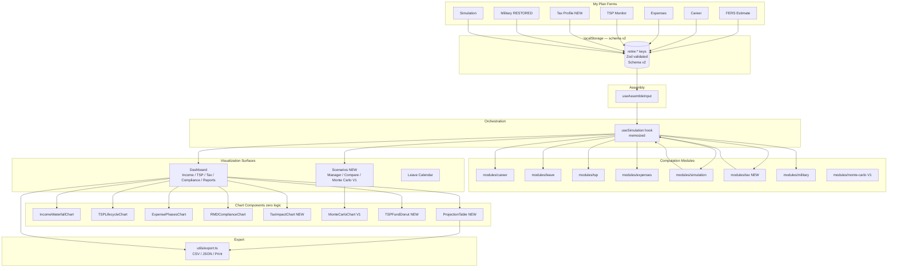

# FedRetire v2 — Engineering & Product Roadmap

> **Status:** Engineering brief — Feb 17, 2026
> **Audience:** Engineering team, product owner
> **Scope:** Evaluation of current codebase → comprehensive retirement-planning product

---

## Table of Contents

1. [Codebase Evaluation](#1-codebase-evaluation)
2. [Feature Roadmap](#2-feature-roadmap)
3. [Technical Design](#3-technical-design)
4. [UX/UI Design](#4-uxui-design)
5. [Visual & Reporting Spec](#5-visual--reporting-spec)
6. [Testing & Quality](#6-testing--quality)
7. [Security & Privacy](#7-security--privacy)
8. [Risks & Mitigations](#8-risks--mitigations)
9. [First 6 PRs](#9-first-6-prs)
10. [Architecture Diagram](#10-architecture-diagram)
11. [Example Data Fixtures](#11-example-data-fixtures)
12. [Implementation Sketches](#12-implementation-sketches)
13. [UI Component List](#13-ui-component-list)

---

## 1. Codebase Evaluation

### 1.1 Architecture Assessment

The codebase is production-quality for its scope. The separation-of-concerns discipline is unusually rigorous for a solo/small-team project.

**Tech stack:** Astro 5 (static) + React 19 + TypeScript 5 (strict) + Tailwind CSS 4 + Recharts 3 + Zod 3 + Vitest 3. Package manager: pnpm.

**Codebase size:** ~120 TypeScript/TSX files across 27 directories. 446 unit tests + 18 scenario parity tests, all passing.

**Data flow:**
```
Forms → localStorage (Zod) → useAssembleInput → SimulationInput
  → useSimulation (memoized) → SimulationData → Dashboard/Charts
```

**Storage:** 13 keys under `retire:*` in localStorage; schema version 1; migration-ready via `storage/persistence.ts`. All keys Zod-validated via `StoredRecord<T>`.

**Module inventory (all under `app/src/modules/`):**

| Module | Files | Status |
|---|---|---|
| `career/` | 6 | Complete, tested |
| `leave/` | 7 | Complete, tested |
| `tsp/` | 6 | Complete, tested, SECURE 2.0 RMD |
| `military/` | 2 | Complete (UI disconnected) |
| `expenses/` | 4 | Complete, Blanchett smile-curve |
| `simulation/` | 7 | Complete, dual-pot TSP, scenario scaffold |
| `validation/` | 3 | Partial |
| **`tax/`** | **0** | **Missing entirely** |

### 1.2 Strengths

- **Auditability:** Formula registry + regulatory-mapping docs cover every calculation; OPM, IRC, CFR citations present.
- **Model purity:** No business logic in UI components or chart components. Zero logic in chart layer.
- **Test coverage:** 446 unit tests, 18 spreadsheet-parity scenarios against `Retire-original.xlsx` within documented tolerances.
- **SECURE 2.0 compliance:** RMD start age is dynamic (73 for pre-1960, 75 for 1960+).
- **Dual-pot TSP:** Traditional/Roth correctly separated; agency match correctly Traditional-only.
- **Schema versioning:** Migration infrastructure in place; adding fields is safe.
- **Blanchett curve:** Empirically-grounded expense smile curve; GoGo/GoSlow/NoGo phases implemented.

### 1.3 Pain Points & Gaps

**Critical gaps (blocking completeness):**

1. **No tax module.** The biggest missing piece. Simulation outputs gross income only. Users cannot see after-tax income in retirement, cannot model Roth conversion ladders, withdrawal sequencing, IRMAA, or state-tax impact. Only `pre-tax` / `after-tax` appear in comments — zero calculation code.

2. **No withdrawal sequencing.** Simulation draws from Traditional TSP at a flat rate; it does not optimize Roth vs. Traditional draws to minimize lifetime taxes.

3. **No TSP monitoring/tracking.** Current model accepts a point-in-time balance. No balance history, no fund allocation (G/F/C/S/I/L), no contribution history, no CSV import from MyAccount.tsp.gov.

4. **Scenario UI not built.** `modules/simulation/scenario-comparison.ts` and storage key `SCENARIOS` exist, but there is no UI to create, name, save, or compare scenarios. The `SimulationConfig` interface (172 fields) has no corresponding form.

5. **No export.** No CSV download of the projection table. No PDF/print capability.

6. **No Monte Carlo.** Deterministic only. Users cannot assess sequence-of-returns risk.

**Secondary gaps:**

7. **Military tab disconnected.** `MilitaryServiceForm.tsx` and `MilitaryBuybackSummary` exist but are not rendered. Re-connecting is low-effort.

8. **`SimulationForm` limited.** `SimulationConfig` has withdrawal strategy, asset allocation, and risk tolerance fields; none are exposed in the UI.

9. **No alert/monitoring system.** No warnings for: approaching TSP contribution limits, RMD deadlines, beneficiary form gaps.

10. **Single implicit user profile.** All localStorage keys are unkeyed; adding a second user/scenario requires forking the storage model.

### 1.4 Concrete Files & Areas to Change

| Priority | File | Change |
|---|---|---|
| High | `app/src/models/tax.ts` (new) | Tax data models |
| High | `app/src/modules/tax/` (new dir) | Tax calculation module |
| High | `app/src/models/simulation.ts` | Add `afterTaxIncome`, `federalTax`, `stateTax`, `irmaaSurcharge` to `SimulationYearResult` |
| High | `app/src/hooks/useSimulation.ts` | Wire tax module into simulation pipeline |
| High | `app/src/storage/schema.ts` | Add `TAX_PROFILE`, `TSP_ACCOUNT_SNAPSHOTS`, `NAMED_SCENARIOS` keys; bump to schema v2 |
| Medium | `app/src/models/tsp.ts` | Add `TSPAccountSnapshot`, `TSPFundAllocation`, `TSPBalanceHistoryEntry` |
| Medium | `app/src/modules/tsp/import.ts` (new) | TSP CSV parser |
| Medium | `app/src/components/layout/AppShell.tsx` | Add Tax, Scenarios top-level nav items |
| Medium | `app/src/components/forms/TaxProfileForm.tsx` (new) | Tax profile form |
| Medium | `app/src/components/scenarios/` (new dir) | Scenario manager + comparison UI |
| Medium | `app/src/utils/export.ts` (new) | CSV + print export utilities |
| Low | `app/src/components/forms/SimulationForm.tsx` | Expose withdrawal-strategy and asset-allocation fields |
| Low | `app/src/components/forms/MilitaryServiceForm.tsx` | Re-connect to FormShell |
| Low | `app/src/modules/simulation/monte-carlo.ts` (new) | Stochastic overlay |

---

## 2. Feature Roadmap

### 2.1 Epics Overview

| Epic | Description | MVP | V1 | V2 |
|---|---|---|---|---|
| E1 | Tax-in-Retirement Modeling | ✓ | ✓ | ✓ |
| E2 | TSP Monitoring & Import | ✓ | ✓ | |
| E3 | Scenario Management | ✓ | ✓ | |
| E4 | Export & Reports | ✓ | ✓ | |
| E5 | Withdrawal Sequencing | | ✓ | |
| E6 | Monte Carlo / Stochastic | | ✓ | |
| E7 | State Tax (Top 10 states) | | ✓ | |
| E8 | IRMAA Modeling | | ✓ | |
| E9 | Roth Conversion Ladder | | | ✓ |
| E10 | Multi-Profile / Family | | | ✓ |
| E11 | Alert & Monitoring System | | ✓ | |
| E12 | Military Tab Re-connect | ✓ | | |
| E13 | Mobile-Optimized Views | | ✓ | ✓ |
| E14 | Beneficiary & Estate Notes | | | ✓ |

### 2.2 MVP — Months 1–3

**Goal:** After-tax income visible in dashboard; TSP balance tracking; first named scenario; CSV export.

**Acceptance criteria:**
- Dashboard shows gross and after-tax income for each projection year.
- Federal income tax computed correctly for `single` and `married-joint` filing statuses.
- Social Security provisional income correctly computes 0%/50%/85% taxable fraction.
- User can enter TSP fund allocations and import a TSP.gov CSV transaction file.
- User can save current inputs as a named scenario and view a 2-column comparison table.
- Projection table is exportable as CSV.
- All existing 446 unit tests still pass; new tax module has ≥ 90% branch coverage.

**Sprint-sized tasks (2-week sprints):**

| Sprint | Task | Estimate | Files |
|---|---|---|---|
| S1 | Tax module: federal brackets + SS provisional income | M (3d) | `models/tax.ts`, `modules/tax/brackets.ts`, `modules/tax/social-security.ts`, `modules/tax/federal.ts` |
| S1 | Tax storage key + migration v1→v2 | S (1d) | `storage/schema.ts`, `storage/migrations/` |
| S1 | TaxProfileForm: filing status, state, deductions toggle | M (2d) | `components/forms/TaxProfileForm.tsx`, `FormShell.tsx` |
| S2 | Wire tax into useSimulation + SimulationYearResult | M (3d) | `hooks/useSimulation.ts`, `models/simulation.ts`, `modules/simulation/income-projection.ts` |
| S2 | TaxImpactChart: stacked federal/state/IRMAA bar | S (2d) | `components/charts/TaxImpactChart.tsx` |
| S2 | After-tax summary card in SummaryPanel | S (1d) | `components/cards/SummaryPanel.tsx` |
| S3 | TSP balance history data model + storage | S (1d) | `models/tsp.ts`, `storage/schema.ts` |
| S3 | TSP fund allocation UI (G/F/C/S/I/L sliders) | M (2d) | `components/forms/FERSEstimateForm.tsx` |
| S3 | TSP CSV import parser + file upload UI | M (3d) | `modules/tsp/import.ts`, `components/forms/TSPImportModal.tsx` |
| S4 | Named scenario save/load | M (2d) | `components/scenarios/ScenarioManager.tsx`, `storage/schema.ts` |
| S4 | 2-column scenario comparison table | M (2d) | `components/scenarios/ScenarioComparison.tsx` |
| S4 | CSV export of projection table | S (1d) | `utils/export.ts` |
| S4 | Military tab re-connect | S (1d) | `components/layout/FormShell.tsx`, `components/forms/MilitaryServiceForm.tsx` |

### 2.3 V1 — Months 4–6

**Goal:** Complete tax picture; stochastic risk; state tax for top 10 states; alert system; optimized mobile.

**Sprint tasks:**

| Sprint | Task | Estimate |
|---|---|---|
| S5 | Withdrawal sequencing optimizer (3-bucket: Roth-last) | L (5d) |
| S5 | IRMAA bracket calculation (2024 thresholds) | M (2d) |
| S5 | State tax module stub (top 10: CA, TX, FL, NY, VA, MD, WA, PA, OH, NC) | L (5d) |
| S6 | Monte Carlo engine: Box-Muller, 1000 simulations, P10/P50/P90 bands | L (5d) |
| S6 | MonteCarloChart: confidence band visualization | M (3d) |
| S7 | Alert system: RMD deadlines, contribution limits, TSP gap warnings | M (3d) |
| S7 | Roth conversion opportunity detector (pre-SS years) | M (3d) |
| S7 | PDF/print export with print CSS | M (2d) |
| S8 | Mobile navigation refactor: bottom tab bar | M (3d) |
| S8 | Responsive chart sizing + touch gestures | M (3d) |

### 2.4 V2 — Months 7–12

**Goal:** Full tax optimization; multi-profile; estate/beneficiary; accessibility pass.

| Feature | Estimate |
|---|---|
| Roth conversion ladder optimizer (year-by-year bracket filling) | XL (2wk) |
| Multi-profile / spouse scenario | XL (2wk) |
| Beneficiary & estate planning notes | M (1wk) |
| Full 50-state tax database | L (1wk) |
| Historical market data for Monte Carlo calibration | L (1wk) |
| WCAG 2.1 AA accessibility audit + fixes | L (1wk) |
| Native mobile packaging (Capacitor/Expo eval) | XL (2wk) |

---

## 3. Technical Design

### 3.1 New Data Models

**`app/src/models/tax.ts`** (new file):

```typescript
import type { ISODate, Rate } from './common';

/** Filing status per IRC § 1 */
export type FilingStatus =
  | 'single'
  | 'married-joint'
  | 'married-separate'
  | 'head-of-household';

/** Two-character USPS state code, or null for states with no income tax */
export type StateCode = string | null;

/** User's tax configuration */
export interface TaxProfile {
  filingStatus: FilingStatus;
  /** USPS 2-letter code; null = "no state income tax" */
  stateCode: StateCode;
  /** Year of this state residency (tax law can change by year) */
  stateResidencyYear: number;
  /** 'standard' or itemized dollar amount */
  deductionStrategy: 'standard' | number;
  /** Whether to model IRMAA surcharges (Medicare Part B/D) */
  modelIrmaa: boolean;
}

/** A single federal income tax bracket for one filing status and year */
export interface FederalBracket {
  year: number;
  filingStatus: FilingStatus;
  minIncome: number;
  maxIncome: number | null; // null = unbounded top bracket
  rate: Rate;
}

/** Per-year tax calculation result, attached to SimulationYearResult */
export interface TaxYearResult {
  year: number;
  age: number;
  grossIncome: number;
  adjustedGrossIncome: number;
  deduction: number;
  federalTaxableIncome: number;
  federalTax: number;
  /** 0 | 0.5 | 0.85 — fraction of SS benefit subject to federal tax */
  socialSecurityTaxableFraction: number;
  stateTax: number;
  /** Medicare IRMAA Part B + Part D surcharge (annual) */
  irmaaSurcharge: number;
  totalTax: number;
  effectiveFederalRate: Rate;
  effectiveTotalRate: Rate;
  afterTaxIncome: number;
}

/** State tax rule — stub for MVP, full 50-state in V2 */
export interface StateTaxRule {
  stateCode: string;
  year: number;
  /** True if this state exempts FERS annuity */
  exemptsFersAnnuity: boolean;
  /** True if this state exempts TSP withdrawals */
  exemptsTspWithdrawals: boolean;
  /** True if this state has no income tax at all */
  noIncomeTax: boolean;
  /** Flat rate or marginal brackets (MVP uses flat approximation) */
  approximateFlatRate: Rate;
  /** Source reference */
  source: string;
}
```

**Updates to `app/src/models/tsp.ts`:**

```typescript
// Add to existing models:

/** TSP investment fund identifier */
export type TSPFundCode =
  | 'G' | 'F' | 'C' | 'S' | 'I'
  | 'L-Income' | 'L2025' | 'L2030' | 'L2035'
  | 'L2040' | 'L2045' | 'L2050' | 'L2055' | 'L2060' | 'L2065';

/** Allocation of one fund across Traditional and Roth buckets */
export interface TSPFundAllocation {
  fund: TSPFundCode;
  percentTraditional: number; // 0–100
  percentRoth: number;        // 0–100 (must sum to 100 with percentTraditional)
}

/** A point-in-time account snapshot (from TSP.gov or manual entry) */
export interface TSPAccountSnapshot {
  id: string;
  asOf: ISODate;
  source: 'manual' | 'csv-import';
  traditionalBalance: number;
  rothBalance: number;
  ytdEmployeeContributions: number;
  ytdAgencyContributions: number;
  fundAllocations: TSPFundAllocation[];
  notes?: string;
}

/** A single row from TSP.gov account statement CSV */
export interface TSPTransactionRow {
  date: ISODate;
  description: string;
  source: 'employee' | 'agency-auto' | 'agency-match' | 'earnings' | 'withdrawal' | 'other';
  amount: number; // positive = deposit, negative = withdrawal
  runningBalance: number;
}
```

**Updates to `app/src/models/simulation.ts`:**

Add fields to `SimulationYearResult`:

```typescript
// Extend SimulationYearResult with:
federalTax: number;
stateTax: number;
irmaaSurcharge: number;
totalTax: number;
afterTaxIncome: number;
effectiveFederalRate: number;
socialSecurityTaxableFraction: 0 | 0.5 | 0.85;
```

### 3.2 Storage & Migration Plan

**Schema v2 additions to `storage/schema.ts`:**

```typescript
export const CURRENT_SCHEMA_VERSION = 2; // bump from 1

export const STORAGE_KEYS = {
  // --- existing keys (unchanged) ---
  PERSONAL_INFO:      'retire:personal-info',
  CAREER_PROFILE:     'retire:career-profile',
  LEAVE_BALANCE:      'retire:leave-balance',
  TSP_BALANCES:       'retire:tsp-balances',       // deprecated in v3; keep for migration
  TSP_CONTRIBUTIONS:  'retire:tsp-contributions',
  MILITARY_SERVICE:   'retire:military-service',
  EXPENSE_PROFILE:    'retire:expense-profile',
  ASSUMPTIONS:        'retire:assumptions',
  FERS_ESTIMATE:      'retire:fers-estimate',
  FERS_FORM_DRAFT:    'retire:fers-form-draft',
  SCENARIOS:          'retire:scenarios',           // was stub; now active
  LEAVE_CALENDAR:     'retire:leave-calendar',
  SIMULATION_CONFIG:  'retire:simulation-config',
  // --- v2 additions ---
  TAX_PROFILE:        'retire:tax-profile',         // NEW: TaxProfile
  TSP_SNAPSHOTS:      'retire:tsp-snapshots',       // NEW: TSPAccountSnapshot[]
  NAMED_SCENARIOS:    'retire:named-scenarios',     // NEW: NamedScenario[]
  ALERTS_CONFIG:      'retire:alerts-config',       // NEW: AlertsConfig
} as const;
```

**Migration `storage/migrations/v1-to-v2.ts`** (new file):

```typescript
export function migrateV1ToV2(stored: Record<string, unknown>): Record<string, unknown> {
  // TSP_BALANCES: wrap single TSPBalances into TSPAccountSnapshot[]
  const legacyTspKey = 'retire:tsp-balances';
  if (stored[legacyTspKey]) {
    const legacy = (stored[legacyTspKey] as StoredRecord<TSPBalances>).data;
    const snapshot: TSPAccountSnapshot = {
      id: crypto.randomUUID(),
      asOf: legacy.asOf,
      source: 'manual',
      traditionalBalance: legacy.traditionalBalance,
      rothBalance: legacy.rothBalance,
      ytdEmployeeContributions: 0,
      ytdAgencyContributions: 0,
      fundAllocations: [],
    };
    stored['retire:tsp-snapshots'] = wrapRecord([snapshot], 2);
  }
  // TAX_PROFILE: initialize with safe defaults
  if (!stored['retire:tax-profile']) {
    const defaultProfile: TaxProfile = {
      filingStatus: 'single',
      stateCode: null,
      stateResidencyYear: new Date().getFullYear(),
      deductionStrategy: 'standard',
      modelIrmaa: false,
    };
    stored['retire:tax-profile'] = wrapRecord(defaultProfile, 2);
  }
  return stored;
}
```

**Schema versioning rule:** Migrations run lazily on read in `persistence.ts`. Each `CURRENT_SCHEMA_VERSION` bump requires a corresponding migration function. Migrations must be idempotent (safe to re-run).

### 3.3 New Module: `modules/tax/`

```
app/src/modules/tax/
  brackets.ts          — Federal bracket data (2023–2026); COLA-adjusted
  federal.ts           — computeFederalTax(taxableIncome, filingStatus, year)
  social-security.ts   — computeSSTaxableFraction(provisionalIncome, filingStatus)
  irmaa.ts             — computeIrmaaSurcharge(magi, filingStatus, year)
  state.ts             — StateTaxRule registry + computeStateTax(income, stateCode, year)
  sequencing.ts        — withdrawalSequence(yearResult, strategy) [V1]
  index.ts             — barrel export
```

**Formula registry entries required before coding:**
- `tax/federal-bracket` — IRC § 1; annual bracket data
- `tax/ss-provisional-income` — IRC § 86; provisional income formula
- `tax/irmaa` — SSA POMS HI 01101.020; IRMAA thresholds
- `tax/state` — State-specific citations per state

### 3.4 Integration Points

**TSP.gov CSV Import:**
TSP.gov → MyAccount → Account Activity → Export to CSV. The file format (as of 2025):
```
Date,Transaction Description,Fund,Source,Amount,Share Price,Shares,Running Balance
01/02/2025,Employee Contribution,C Fund,Employee,$922.00,$87.45,10.543,$234,567.89
```

Parser target: `modules/tsp/import.ts` → `parseTSPCSV(csvText: string): TSPTransactionRow[]`

The parser must:
1. Handle BOM-prefixed UTF-8 (common in Windows-generated CSVs)
2. Map TSP fund names to `TSPFundCode` enum
3. Map source descriptions to `TSPTransactionRow.source`
4. Reject files with unexpected headers and return a typed parse error

**No third-party CSV library.** Use native string split + trim; file is simple enough. Zero-dependency policy is appropriate here.

**PDF Export:**
Use browser's native `window.print()` with a `@media print` CSS stylesheet that hides nav, forms, and interactive elements and renders only the projection table and summary cards. Zero new dependencies. Add a `print:` Tailwind variant where needed.

---

## 4. UX/UI Design

### 4.1 Navigation Hierarchy (Menu Tree)

```
My Plan                           [top-level tab]
  ├── FERS Estimate               — personal info, salary, High-3, annuity options
  ├── Career                      — career events timeline
  ├── Expenses                    — 10 categories, inflation, smile curve
  ├── TSP                         — balances, contributions, fund allocation, import
  ├── Tax Profile      [NEW]      — filing status, state, deduction strategy, IRMAA toggle
  ├── Military         [RESTORE]  — military service, buyback
  └── Simulation                  — projection assumptions, withdrawal strategy

Tax                  [NEW top-level tab]
  ├── Income Sources              — breakdown of taxable/tax-deferred/tax-free income
  ├── Bracket Preview             — current-year bracket calculator (what-if)
  ├── Withdrawal Strategy         — Roth-last / bracket-fill / custom sequencing [V1]
  └── State Tax                   — state residency + exemption status [V1]

Leave                             [top-level tab, unchanged]
  └── Calendar                    — (existing leave calendar)

Scenarios            [NEW top-level tab]
  ├── My Scenarios                — list of saved named scenarios
  ├── Compare (2-up)              — side-by-side metric comparison
  └── Monte Carlo     [V1]        — confidence band simulation

Dashboard                         [top-level tab, unlocks when My Plan complete]
  ├── Summary                     — 9 summary cards + key alerts
  ├── Income                      — IncomeWaterfallChart, TaxImpactChart
  ├── TSP & Investments           — TSPLifecycleChart, fund allocation donut
  ├── Expenses                    — ExpensePhasesChart, smile curve
  ├── Compliance                  — RMDComplianceChart, contribution limits
  └── Reports                     — exportable table + print/CSV button
```

### 4.2 Responsive Behavior Rules

| Breakpoint | Viewport | Nav Pattern | Content |
|---|---|---|---|
| `sm` | < 640px | Bottom tab bar (5 icons) + slide-up drawer for sub-tabs | Single-column, full-width |
| `md` | 640–1024px | Top horizontal nav + collapsible sub-tab sidebar | Two-column (form + preview) |
| `lg` | > 1024px | Top horizontal nav + persistent left sidebar for sub-tabs | Three-column or wide two-column |

**Behavior rules:**
- Active tab is always visible; no horizontal scroll on tab bar.
- On `sm`, tapping a top-level tab opens a slide-up drawer listing sub-tabs; selecting a sub-tab closes the drawer.
- Charts reflow to single-column stacks on `sm`; tooltips become tap-activated (not hover).
- Form input groups use `grid-cols-1 md:grid-cols-2` by default; wider inputs (salary, date) span full width at all sizes.
- The Dashboard is card-grid: `grid-cols-1 sm:grid-cols-2 lg:grid-cols-3` for summary cards; charts are always full-width.
- Print layout: single-column, no nav, no forms, projection table + summary cards only.

### 4.3 Desktop Wireframe (≥ 1024px)

```
┌────────────────────────────────────────────────────────────────┐
│  ◆ FedRetire    [My Plan] [Tax] [Leave] [Scenarios] [Dashboard]│
├──────────────────┬─────────────────────────────────────────────┤
│ My Plan          │  Tax Profile                                │
│ ──────────────   │                                             │
│ ✓ FERS Estimate  │  Filing Status                              │
│ ✓ Career         │  ○ Single  ● Married (Joint)  ○ MFS  ○ HoH │
│ ✓ Expenses       │                                             │
│ ✓ TSP            │  State of Residence                         │
│ ● Tax Profile    │  [Virginia (VA)               ▼]            │
│ ○ Military       │                                             │
│ ○ Simulation     │  Deduction Strategy                         │
│                  │  ● Standard deduction ($29,200 MFJ 2025)    │
│ Completion       │  ○ Itemize:  [$____________]                │
│ ██████░░░░ 67%   │                                             │
│                  │  □ Model IRMAA Medicare surcharges          │
│                  │                                             │
│                  │  [Save]                                     │
└──────────────────┴─────────────────────────────────────────────┘
```

### 4.4 Mobile Wireframe (< 640px)

```
┌───────────────────────┐
│  ◆ FedRetire      ☰  │
├───────────────────────┤
│  Tax Profile          │
│                       │
│  Filing Status        │
│  [Married (Joint) ▼]  │
│                       │
│  State                │
│  [Virginia       ▼]   │
│                       │
│  Deductions           │
│  ● Standard  ○ Itemize│
│                       │
│  □ Model IRMAA        │
│                       │
│  ┌─────────────────┐  │
│  │     Save        │  │
│  └─────────────────┘  │
│                       │
│                       │
│                       │
├───────────────────────┤
│  Plan Tax Leave Scen  │
│   ●   ○   ○   ○   ○  │
└───────────────────────┘
```

**Dashboard mobile view:**
```
┌───────────────────────┐
│ ◆ FedRetire       ☰  │
├───────────────────────┤
│ Dashboard             │
├───────────────────────┤
│ ┌────────┐ ┌────────┐ │
│ │Annuity │ │After-  │ │
│ │$27,900 │ │Tax Inc │ │
│ │  /yr   │ │$52,340 │ │
│ └────────┘ └────────┘ │
│ ┌────────┐ ┌────────┐ │
│ │TSP Bal │ │Depl    │ │
│ │$723K   │ │Age: -- │ │
│ └────────┘ └────────┘ │
├───────────────────────┤
│  [Income] [TSP] [Tax] │ ← sub-tab strip
├───────────────────────┤
│  [Income chart full   │
│   width stacked bar]  │
│                       │
│                       │
├───────────────────────┤
│ Plan Tax Leave Scen   │
│  ●   ○   ○   ○   ○   │
└───────────────────────┘
```

### 4.5 Accessibility Considerations

- All form inputs must have visible `<label>` (not placeholder-only).
- Color is never the sole indicator; pair with icons or text labels (e.g., surplus = green + ↑, deficit = red + ↓).
- Charts must have `aria-label` descriptions and a companion data table (toggleable).
- Focus management: opening modals traps focus; Escape closes.
- Bottom tab bar icons must include visible text labels at all times (not icon-only).
- WCAG 2.1 AA color contrast: minimum 4.5:1 for text, 3:1 for UI components.
- Keyboard navigation: all interactive elements reachable via Tab; no keyboard traps.
- `prefers-reduced-motion`: disable chart animations if set.
- **Target WCAG 2.1 AA for MVP; full audit in V2.**

---

## 5. Visual & Reporting Spec

### 5.1 Chart Inventory (Current + New)

| Chart | Status | Type | Data Source | New in v2? |
|---|---|---|---|---|
| `PayGrowthChart` | Exists | Line + reference lines | salary history | No |
| `LeaveBalancesChart` | Exists | Stacked bar | leave simulation | No |
| `IncomeWaterfallChart` | Exists | Stacked bar + overlay | incomeWaterfall | No |
| `TSPLifecycleChart` | Exists | Area + transition | tspLifecycle | No |
| `ExpensePhasesChart` | Exists | Area + phase bands | expensePhases | No |
| `RMDComplianceChart` | Exists | Bar + line | rmdTimeline | No |
| `TaxImpactChart` | **New** | Stacked bar (federal/state/IRMAA) + effective rate line | TaxYearResult[] | **YES** |
| `WithdrawalSequenceChart` | **New (V1)** | Stacked area (Roth/Trad/taxable) | withdrawal sequence | YES |
| `MonteCarloChart` | **New (V1)** | Line fan (P10/P50/P90) | monte carlo output | YES |
| `TSPFundDonut` | **New** | Donut | TSPAccountSnapshot | YES |
| `ScenarioComparisonTable` | **New** | HTML table | two NamedScenario | YES |

**TaxImpactChart design:**
- X axis: projection year (age labeled)
- Y axis: dollars
- Bars: stacked `[federal tax, state tax, IRMAA surcharge]`
- Overlay line: effective total tax rate (right Y axis, %)
- Tooltip: gross income, taxable SS fraction, bracket filled, effective rate
- Color palette: red-shades for tax components; neutral for effective rate line

**MonteCarloChart design:**
- X axis: age (retirement year 0 → horizon)
- Y axis: TSP balance ($)
- Three bands: P10 (pessimistic), P50 (median), P90 (optimistic)
- Shaded area between P10 and P90
- Overlaid on deterministic baseline (dashed)
- Tooltip: at hovered age → P10/P50/P90 values

### 5.2 Table Behaviors

**Projection Table (Reports tab):**
- Columns: Year | Age | Annuity | Suppl | SS | TSP Draw | Gross Income | Fed Tax | State Tax | After-Tax | Expenses | Surplus | TSP Balance
- Sortable by year (default asc)
- Sticky header + first column on mobile horizontal scroll
- Row highlight: red background if `surplus < 0`; green if TSP balance > prior year
- Pagination: 10 rows/page default; "Show all" toggle

**Scenario Comparison Table:**
- Two-column layout: Baseline | Scenario B
- Rows: all summary metrics from `SummaryPanel` (9 cards)
- Delta column: Scenario B − Baseline, colored red/green
- Rows with >5% delta highlighted in yellow

### 5.3 Export Options

| Format | Implementation | Dependencies |
|---|---|---|
| CSV | `utils/export.ts` → `exportProjectionCSV()` using `URL.createObjectURL(Blob)` | None |
| PDF | `window.print()` with `@media print` stylesheet | None |
| JSON | `utils/export.ts` → `exportScenarioJSON()` — full `NamedScenario` | None |

**No third-party export libraries.** The projection table is ~40 rows × 13 columns; native Blob + CSV is sufficient.

**CSV output format:**
```csv
Year,Age,Annuity,FERS Supplement,Social Security,TSP Withdrawal,Gross Income,Federal Tax,State Tax,IRMAA,After-Tax Income,Expenses,Net Surplus,TSP Balance
2027,57,$27900,$12300,$0,$18000,$58200,$6420,$0,$0,$51780,$54000,-$2220,$723456
```

---

## 6. Testing & Quality

### 6.1 Tax Module Unit Tests

Required tests in `tests/unit/tax/`:

| Test | Assertion |
|---|---|
| `brackets.test.ts` | 2024 single bracket: $50,000 income → correct marginal + effective rate |
| `brackets.test.ts` | 2024 MFJ bracket: $100,000 income → correct marginal + effective rate |
| `brackets.test.ts` | Bracket boundary exactness: income at bracket edge ±$1 |
| `social-security.test.ts` | Provisional income < $25k (single) → 0% SS taxable |
| `social-security.test.ts` | Provisional income $30k (single) → 50% SS taxable |
| `social-security.test.ts` | Provisional income $40k (single) → 85% SS taxable |
| `irmaa.test.ts` | MAGI $110k single (2024) → tier 1 surcharge |
| `irmaa.test.ts` | MAGI $100k single (2024) → no surcharge |
| `state.test.ts` | VA flat rate applied correctly |
| `state.test.ts` | FL/TX/WA → $0 state tax (no income tax) |
| `federal.test.ts` | FERS annuity: fully taxable (no exclusion ratio for FERS basic) |
| `federal.test.ts` | Roth TSP withdrawal: $0 federal tax impact |

### 6.2 Integration / Scenario Tests

Add two new scenarios to `tests/scenarios/`:

- `tax-impact.test.ts`: GS-straight-through baseline, MFJ filing, VA resident → assert after-tax income within ±$1/yr tolerance
- `roth-conversion-opportunity.test.ts` (V1): Early retiree pre-SS → detect Roth conversion headroom in bracket

Update `baseline.json` to include `afterTaxIncome`, `federalTax`, `totalTax` in expected outputs.

### 6.3 TSP Import Tests

`tests/unit/tsp/import.test.ts`:
- Parse well-formed TSP CSV → correct `TSPTransactionRow[]`
- BOM-prefixed UTF-8 file → parsed correctly
- Unknown fund name → returns `ParseError` with row number
- Negative amount (withdrawal) → `amount < 0`
- Malformed date → `ParseError`

### 6.4 CI/CD Notes

Current: local `pnpm test` only (inferred from Vitest config).

Recommended additions:
1. **GitHub Actions workflow** (`.github/workflows/ci.yml`):
   ```yaml
   on: [push, pull_request]
   jobs:
     test:
       runs-on: ubuntu-latest
       steps:
         - uses: actions/checkout@v4
         - uses: pnpm/action-setup@v4
         - run: cd app && pnpm install && pnpm typecheck && pnpm test
   ```
2. **Branch protection:** Require passing CI on `main`.
3. **No deployment pipeline needed** (static output; no server).
4. **Typecheck is separate from tests** — both must pass in CI (`pnpm typecheck` + `pnpm test`).

---

## 7. Security & Privacy

### 7.1 PII Handling

**Data stored locally only.** No network requests, no analytics, no telemetry. All data in `localStorage` under `retire:*` keys.

**PII present in storage:**
- Name, birth date, SSN partial (if entered) — in `PERSONAL_INFO`
- Salary history — in `CAREER_PROFILE`
- TSP account balance — in `TSP_SNAPSHOTS`
- Military service dates and pay — in `MILITARY_SERVICE`

**Policy:**
- Never log PII to console (add ESLint rule or review checklist).
- TSP account number (if imported from CSV): store only masked form (last 4 digits).
- No `navigator.sendBeacon`, no `fetch` to external URLs anywhere in the codebase.
- Import file (TSP CSV) is read via `FileReader.readAsText()`; never leaves the browser.

### 7.2 Storage Security

**Current state:** `localStorage` is plaintext, readable by any JavaScript on the same origin (which is just the single Astro app — no third-party scripts). This is acceptable for a local-only app.

**Recommendations for V1:**
- Add a lock screen (PIN, optional): use `crypto.subtle.deriveKey` (PBKDF2) to derive an AES-GCM key from PIN; encrypt the `retire:*` values at rest. Store the salt in `localStorage`; never store the raw PIN. This is in-browser symmetric encryption — protection against physical device access, not against JS-level attack on same origin.
- Warn user on first launch: "This app stores sensitive financial data in your browser. Do not use on a shared computer."
- `Clear All Data` button with confirmation dialog (wipes all `retire:*` keys).

**Do NOT implement** server-side storage, user accounts, or cloud sync in MVP or V1. If this changes, a full security review is required.

### 7.3 Regulatory Concerns

- **No securities advice.** The app must display a disclaimer: "This tool is for informational and planning purposes only. It does not constitute tax, legal, or investment advice."
- **OPM FERS Handbook compliance:** All annuity formulas must cite the handbook chapter. Current formula registry already does this.
- **IRS Publication 721** (Tax Guide to U.S. Civil Service Retirement Benefits): FERS annuity taxability, cost recovery, and survivor annuity rules must be cited in formula registry entries for any tax calculations touching FERS.
- **SECURE 2.0 Act:** RMD age already correctly implemented. If user was born 1951+, confirm age 73 is used.
- **Annual bracket updates:** Federal tax brackets adjust for inflation. The `brackets.ts` data file must be updated each January. Add a `TODO` comment noting the update cadence and source (IRS Rev. Proc. annual inflation adjustments).

---

## 8. Risks & Mitigations

| Risk | Likelihood | Impact | Mitigation |
|---|---|---|---|
| Tax law changes (brackets, SS, IRMAA thresholds) | High (annual) | Medium | Isolate bracket data in `data/tax-brackets.ts`; parameterize by year |
| SECURE 2.0 RMD age changes (future legislation) | Low | High | RMD age already parameterized; single constant to update |
| TSP.gov CSV format changes | Medium | Medium | Parser isolated in `tsp/import.ts`; add version detection; fail with clear error |
| localStorage quota exceeded (5MB limit) | Low | Medium | Audit stored payload sizes; use `StorageManager.estimate()` API; warn user if > 4MB |
| Simulation performance (Monte Carlo 1000 runs) | Medium | Low | Run Monte Carlo in `Web Worker`; show loading spinner; cache results until inputs change |
| Roth conversion optimizer produces legally incorrect advice | Medium | High | Label clearly as "estimated opportunity"; cite IRS; add "consult a tax professional" disclaimer |
| Mobile Safari localStorage cleared on app removal | Medium | Medium | Warn user; add JSON export/import for full data backup (`exportScenarioJSON`) |
| Astro breaking changes on upgrade | Low | High | Pin Astro version; audit upgrade notes before bumping |

---

## 9. First 6 PRs

### PR-001: Tax Module Foundation

**Title:** `feat(tax): add federal tax bracket calculator and SS provisional income`

**Purpose:** Foundational tax computation: federal bracket lookup, standard deduction, Social Security taxable fraction per IRC § 86.

**Changed files:**

| File | Action |
|---|---|
| `app/src/models/tax.ts` | Create — `TaxProfile`, `FederalBracket`, `TaxYearResult`, `StateTaxRule` interfaces |
| `app/src/data/tax-brackets.ts` | Create — 2023–2026 bracket data for all filing statuses |
| `app/src/modules/tax/brackets.ts` | Create — `getBracketsForYear(year, filingStatus)`, `getStandardDeduction(year, filingStatus)` |
| `app/src/modules/tax/federal.ts` | Create — `computeFederalTax(taxableIncome, year, filingStatus): number` |
| `app/src/modules/tax/social-security.ts` | Create — `computeSSTaxableFraction(provisionalIncome, filingStatus): 0 \| 0.5 \| 0.85` |
| `app/src/modules/tax/irmaa.ts` | Create — `computeIrmaaSurcharge(magi, filingStatus, year): number` |
| `app/src/modules/tax/state.ts` | Create — stub with 10 state rules; `computeStateTax(annualIncome, stateCode, year): number` |
| `app/src/modules/tax/index.ts` | Create — barrel export |
| `app/tests/unit/tax/` | Create — unit tests for all above |
| `docs/formula-registry.md` | Update — add 4 tax formula entries |
| `docs/regulatory-mapping.md` | Update — add IRC § 1, § 86, POMS HI 01101.020, IRS Pub 721 entries |

**Acceptance criteria:**
- `computeFederalTax(50000, 2024, 'single')` returns `$5,426` (10% on first $11,600 + 12% on remainder).
- `computeSSTaxableFraction(35000, 'single')` returns `0.5`.
- `computeSSTaxableFraction(45000, 'single')` returns `0.85`.
- All new tests pass; existing 446 tests unaffected.

---

### PR-002: Tax Storage, Migration, and Profile Form

**Title:** `feat(tax): add TaxProfile storage key, schema v2 migration, and TaxProfileForm`

**Dependencies:** PR-001

**Changed files:**

| File | Action |
|---|---|
| `app/src/storage/schema.ts` | Update — add `TAX_PROFILE` key; bump `CURRENT_SCHEMA_VERSION` to 2 |
| `app/src/storage/migrations/v1-to-v2.ts` | Create — initialize `TAX_PROFILE` with defaults |
| `app/src/storage/persistence.ts` | Update — wire v1→v2 migration into migration runner |
| `app/src/components/forms/TaxProfileForm.tsx` | Create — filing status radio, state dropdown (50-state + DC), standard/itemize toggle, IRMAA checkbox |
| `app/src/components/forms/FormShell.tsx` | Update — add "Tax Profile" sub-tab between TSP and Military |
| `app/src/hooks/useLocalStorage.ts` | Update — if `schemaVersion < 2`, run migration before returning data |

**Pseudo-code for `TaxProfileForm.tsx`:**
```tsx
export function TaxProfileForm() {
  const [profile, setProfile] = useLocalStorage(STORAGE_KEYS.TAX_PROFILE, TaxProfileSchema);

  return (
    <form onSubmit={handleSave}>
      <RadioGroup
        label="Filing Status"
        name="filingStatus"
        options={FILING_STATUS_OPTIONS}
        value={profile?.filingStatus ?? 'single'}
        onChange={(v) => setProfile((p) => ({ ...p, filingStatus: v }))}
      />
      <StateSelector
        value={profile?.stateCode}
        onChange={(v) => setProfile((p) => ({ ...p, stateCode: v }))}
      />
      <DeductionToggle
        value={profile?.deductionStrategy}
        standardAmount={getStandardDeduction(currentYear, profile?.filingStatus ?? 'single')}
        onChange={(v) => setProfile((p) => ({ ...p, deductionStrategy: v }))}
      />
      <Checkbox
        label="Model IRMAA Medicare surcharges"
        checked={profile?.modelIrmaa ?? false}
        onChange={(v) => setProfile((p) => ({ ...p, modelIrmaa: v }))}
      />
      <Button type="submit">Save</Button>
    </form>
  );
}
```

---

### PR-003: Wire Tax into Simulation Pipeline

**Title:** `feat(simulation): integrate tax module into useSimulation; add after-tax income to projections`

**Dependencies:** PR-001, PR-002

**Changed files:**

| File | Action |
|---|---|
| `app/src/models/simulation.ts` | Update — add tax fields to `SimulationYearResult` |
| `app/src/modules/simulation/income-projection.ts` | Update — call `computeFederalTax`, `computeSSTaxableFraction`, `computeStateTax` per year |
| `app/src/modules/simulation/retirement-simulation.ts` | Update — add tax pass after income projection |
| `app/src/hooks/useSimulation.ts` | Update — read `TAX_PROFILE` from storage; pass to projection; derive `taxTimeline` dataset |
| `app/src/components/charts/TaxImpactChart.tsx` | Create — stacked bar: federal/state/IRMAA + effective rate line |
| `app/src/components/cards/SummaryPanel.tsx` | Update — add "After-Tax Income (Year 1)" card (10th card) |
| `app/tests/scenarios/tax-impact.test.ts` | Create — parity test with expected after-tax values |

**Key interface extension:**
```typescript
// models/simulation.ts — SimulationYearResult additions
federalTaxableIncome: number;   // after deductions
federalTax: number;
stateTax: number;
irmaaSurcharge: number;
totalTax: number;
afterTaxIncome: number;
effectiveFederalRate: number;   // federalTax / grossIncome
socialSecurityTaxableFraction: 0 | 0.5 | 0.85;
```

---

### PR-004: TSP Monitoring — Balance History & Fund Allocation

**Title:** `feat(tsp): add balance history tracking, fund allocation UI, and TSP.gov CSV import`

**Dependencies:** None (parallel with PR-001/002)

**Changed files:**

| File | Action |
|---|---|
| `app/src/models/tsp.ts` | Update — add `TSPAccountSnapshot`, `TSPFundAllocation`, `TSPFundCode`, `TSPTransactionRow` |
| `app/src/storage/schema.ts` | Update — add `TSP_SNAPSHOTS` key |
| `app/src/modules/tsp/import.ts` | Create — `parseTSPCSV(text): TSPTransactionRow[] \| ParseError` |
| `app/src/components/forms/TSPMonitorPanel.tsx` | Create — balance history table + "Add Snapshot" + "Import CSV" button |
| `app/src/components/forms/TSPImportModal.tsx` | Create — file picker + parse result preview + confirm/reject |
| `app/src/components/charts/TSPFundDonut.tsx` | Create — donut of fund allocation from latest snapshot |
| `app/tests/unit/tsp/import.test.ts` | Create — parser tests |

**CSV import sketch:**
```typescript
// modules/tsp/import.ts
const TSP_FUND_MAP: Record<string, TSPFundCode> = {
  'G Fund': 'G', 'F Fund': 'F', 'C Fund': 'C',
  'S Fund': 'S', 'I Fund': 'I',
  'L Income': 'L-Income', 'L 2025': 'L2025', /* ... */
};

const EXPECTED_HEADERS = ['Date','Transaction Description','Fund','Source','Amount','Share Price','Shares','Running Balance'];

export function parseTSPCSV(raw: string): TSPTransactionRow[] | ParseError {
  // Strip BOM
  const text = raw.startsWith('\uFEFF') ? raw.slice(1) : raw;
  const lines = text.trim().split('\n');
  const headers = lines[0].split(',').map(h => h.trim());

  if (!EXPECTED_HEADERS.every((h, i) => headers[i] === h)) {
    return { type: 'parse-error', message: 'Unexpected CSV format. Expected TSP account activity export.', row: 0 };
  }

  return lines.slice(1).map((line, i): TSPTransactionRow => {
    const cols = line.split(',').map(c => c.trim().replace(/^"|"$/g, ''));
    const amount = parseFloat(cols[4].replace(/[$,]/g, ''));
    const fund = TSP_FUND_MAP[cols[2]] ?? null;
    if (!fund) return { type: 'parse-error', message: `Unknown fund: ${cols[2]}`, row: i + 2 };
    return {
      date: parseMMDDYYYY(cols[0]),
      description: cols[1],
      source: mapSource(cols[3]),
      amount,
      runningBalance: parseFloat(cols[7].replace(/[$,]/g, '')),
    };
  });
}
```

---

### PR-005: Named Scenario Management & Comparison

**Title:** `feat(scenarios): add scenario save/load, named scenario manager, and 2-column comparison`

**Dependencies:** PR-003 (needs full simulation output to save)

**Changed files:**

| File | Action |
|---|---|
| `app/src/models/scenario.ts` | Create — `NamedScenario { id, label, createdAt, inputs: SimulationInput, result: FullSimulationResult }` |
| `app/src/storage/schema.ts` | Update — add `NAMED_SCENARIOS` key |
| `app/src/components/layout/AppShell.tsx` | Update — add "Scenarios" top-level nav tab |
| `app/src/components/scenarios/ScenarioManager.tsx` | Create — list of saved scenarios, save current, delete, rename |
| `app/src/components/scenarios/ScenarioComparison.tsx` | Create — 2-column metric table; delta column |
| `app/src/pages/index.astro` | Update — mount ScenarioManager route |

**Scenario storage structure:**
```typescript
// models/scenario.ts
export interface NamedScenario {
  id: string;              // crypto.randomUUID()
  label: string;           // user-defined name
  createdAt: ISODate;
  description?: string;
  /** Snapshot of all inputs at time of save */
  inputs: SimulationInput;
  /** Snapshot of full simulation result at time of save */
  result: FullSimulationResult;
  /** Whether this is the "baseline" (pinned) scenario */
  isBaseline: boolean;
}
```

**Comparison table columns:**
```
Metric                     | Baseline        | Scenario B      | Δ
---------------------------|-----------------|-----------------|--------
Annual Annuity             | $27,900         | $31,200         | +$3,300 ▲
Monthly After-Tax Income   | $4,315          | $4,820          | +$505 ▲
TSP Balance at 85          | $723,456        | $489,210        | -$234K ▼
TSP Depletion Age          | Never           | Age 81          | ▼
Total Lifetime Tax         | $187,450        | $142,380        | -$45K ▲
Federal Effective Rate     | 11.0%           | 9.4%            | -1.6pp ▲
Lifetime Surplus           | $1,234,567      | $967,890        | -$267K ▼
```

---

### PR-006: CSV & Print Export

**Title:** `feat(reports): add CSV projection export, JSON scenario export, and print-optimized layout`

**Dependencies:** PR-003 (needs tax-enriched projection), PR-005 (scenario export)

**Changed files:**

| File | Action |
|---|---|
| `app/src/utils/export.ts` | Create — `exportProjectionCSV()`, `exportScenarioJSON()`, `triggerDownload()` |
| `app/src/components/charts/ProjectionTable.tsx` | Create — full projection table; sortable; mobile horizontal scroll |
| `app/src/components/layout/Dashboard.tsx` | Update — add "Reports" sub-tab; wire export buttons |
| `app/src/styles/print.css` | Create — `@media print` rules hiding nav/forms; table-friendly layout |

**`utils/export.ts` sketch:**
```typescript
export function exportProjectionCSV(years: SimulationYearResult[]): void {
  const headers = [
    'Year','Age','Annuity','FERS Supplement','Social Security',
    'TSP Withdrawal','Gross Income','Federal Tax','State Tax',
    'IRMAA','After-Tax Income','Expenses','Net Surplus','TSP Balance'
  ];
  const rows = years.map(y => [
    y.year, y.age, y.annuity, y.fersSupplement, y.socialSecurity,
    y.tspWithdrawal, y.totalIncome, y.federalTax, y.stateTax,
    y.irmaaSurcharge, y.afterTaxIncome, y.totalExpenses,
    y.surplus, y.totalTSPBalance,
  ]);
  const csv = [headers, ...rows].map(r => r.join(',')).join('\n');
  triggerDownload(csv, 'text/csv', `retirement-projection-${new Date().toISOString().slice(0,10)}.csv`);
}

export function triggerDownload(content: string, mimeType: string, filename: string): void {
  const blob = new Blob([content], { type: mimeType });
  const url = URL.createObjectURL(blob);
  const a = document.createElement('a');
  a.href = url; a.download = filename; a.click();
  URL.revokeObjectURL(url);
}
```

---

## 10. Architecture Diagram



---

## 11. Example Data Fixtures

### 11.1 TSP Account Snapshot (JSON)

```json
{
  "schemaVersion": 2,
  "updatedAt": "2026-02-17T10:00:00Z",
  "data": [
    {
      "id": "snap-001",
      "asOf": "2026-01-31",
      "source": "csv-import",
      "traditionalBalance": 487234.56,
      "rothBalance": 83450.22,
      "ytdEmployeeContributions": 3840.00,
      "ytdAgencyContributions": 1536.00,
      "fundAllocations": [
        { "fund": "C", "percentTraditional": 50, "percentRoth": 50, "balanceTraditional": 243617.28, "balanceRoth": 41725.11 },
        { "fund": "S", "percentTraditional": 20, "percentRoth": 20, "balanceTraditional": 97446.91, "balanceRoth": 16690.04 },
        { "fund": "I", "percentTraditional": 15, "percentRoth": 15, "balanceTraditional": 73085.18, "balanceRoth": 12517.53 },
        { "fund": "G", "percentTraditional": 15, "percentRoth": 15, "balanceTraditional": 73085.18, "balanceRoth": 12517.53 }
      ],
      "notes": "Imported from TSP.gov 2026-02-17"
    }
  ]
}
```

### 11.2 Tax Profile (JSON)

```json
{
  "schemaVersion": 2,
  "updatedAt": "2026-02-17T10:00:00Z",
  "data": {
    "filingStatus": "married-joint",
    "stateCode": "VA",
    "stateResidencyYear": 2026,
    "deductionStrategy": "standard",
    "modelIrmaa": true
  }
}
```

### 11.3 Named Scenario (JSON stub)

```json
{
  "schemaVersion": 2,
  "updatedAt": "2026-02-17T10:00:00Z",
  "data": [
    {
      "id": "scen-001",
      "label": "Retire at 57 — MRA+30",
      "createdAt": "2026-02-17",
      "isBaseline": true,
      "description": "Retire Feb 2027 at MRA with 31 years service, high-3 $94k",
      "inputs": { "...": "SimulationInput snapshot" },
      "result": {
        "depletionAge": null,
        "balanceAt85": 723456,
        "totalLifetimeIncome": 1847569,
        "totalLifetimeTax": 187450,
        "totalLifetimeAfterTaxIncome": 1660119,
        "years": [ "...40 SimulationYearResult objects..." ]
      }
    },
    {
      "id": "scen-002",
      "label": "Retire at 60 — +3 years",
      "createdAt": "2026-02-17",
      "isBaseline": false,
      "description": "Work 3 more years; higher high-3, larger annuity",
      "inputs": { "...": "SimulationInput snapshot" },
      "result": {
        "depletionAge": null,
        "balanceAt85": 1102334,
        "totalLifetimeIncome": 2134980,
        "totalLifetimeTax": 231890,
        "totalLifetimeAfterTaxIncome": 1903090,
        "years": [ "...37 SimulationYearResult objects..." ]
      }
    }
  ]
}
```

### 11.4 Tax Projection Input (TypeScript fixture for tests)

```typescript
// tests/unit/tax/fixtures.ts
export const singleFilerFixture: TaxProjectionInput = {
  year: 2027,
  filingStatus: 'single',
  stateCode: 'VA',
  ordinaryIncome: 27900 + 18000,   // annuity + TSP draw
  socialSecurityBenefit: 0,         // pre-62, no SS
  rothWithdrawal: 0,
  qualifiedDividends: 0,
  deductions: 'standard',           // $15,000 standard 2027 (estimated)
};

export const mfjFilerFixture: TaxProjectionInput = {
  year: 2027,
  filingStatus: 'married-joint',
  stateCode: 'VA',
  ordinaryIncome: 27900 + 18000,
  socialSecurityBenefit: 24000,     // $2k/mo at 62
  rothWithdrawal: 5000,
  qualifiedDividends: 0,
  deductions: 'standard',
};
// expected: socialSecurityTaxableFraction = 0.85 (provisional income well above $44k threshold)
```

---

## 12. Implementation Sketches

### 12.1 Federal Tax Calculator (TypeScript)

```typescript
// modules/tax/federal.ts

import { getBracketsForYear, getStandardDeduction } from './brackets';
import type { FilingStatus } from '@models/tax';

/**
 * Computes federal income tax using marginal bracket method.
 *
 * Formula ID: tax/federal-bracket
 * Source: IRC § 1; IRS Rev. Proc. (annual COLA adjustments)
 *
 * @param taxableIncome - Gross income minus deductions; must be >= 0
 * @param year - Tax year (determines bracket thresholds)
 * @param filingStatus - Per IRC § 1
 * @returns Federal income tax owed (before credits)
 */
export function computeFederalTax(
  taxableIncome: number,
  year: number,
  filingStatus: FilingStatus,
): number {
  if (taxableIncome <= 0) return 0;

  const brackets = getBracketsForYear(year, filingStatus);
  let tax = 0;
  let remaining = taxableIncome;

  for (const bracket of brackets) {
    if (remaining <= 0) break;
    const bracketWidth = bracket.maxIncome !== null
      ? bracket.maxIncome - bracket.minIncome
      : Infinity;
    const taxableInBracket = Math.min(remaining, bracketWidth);
    tax += taxableInBracket * bracket.rate;
    remaining -= taxableInBracket;
  }

  return Math.round(tax * 100) / 100; // round to cents
}

/**
 * Computes federal taxable income after standard or itemized deduction.
 */
export function computeFederalTaxableIncome(
  agi: number,
  year: number,
  filingStatus: FilingStatus,
  deductionStrategy: 'standard' | number,
): number {
  const deduction = deductionStrategy === 'standard'
    ? getStandardDeduction(year, filingStatus)
    : deductionStrategy;
  return Math.max(0, agi - deduction);
}
```

### 12.2 Social Security Provisional Income (TypeScript)

```typescript
// modules/tax/social-security.ts

import type { FilingStatus } from '@models/tax';

/**
 * Computes the taxable fraction of Social Security benefits.
 *
 * Formula ID: tax/ss-provisional-income
 * Source: IRC § 86
 *
 * Provisional income = AGI + tax-exempt interest + 50% of SS benefit
 *
 * Thresholds (2024, not inflation-adjusted by statute):
 *   Single/HoH:  $25,000 (0%) → $34,000 (50%) → above (85%)
 *   MFJ:         $32,000 (0%) → $44,000 (50%) → above (85%)
 *   MFS:         $0 → all SS is 85% taxable (punitive)
 *
 * @returns 0, 0.5, or 0.85
 */
export function computeSSTaxableFraction(
  provisionalIncome: number,
  filingStatus: FilingStatus,
): 0 | 0.5 | 0.85 {
  if (filingStatus === 'married-separate') return 0.85;

  const [lower, upper] = filingStatus === 'married-joint'
    ? [32_000, 44_000]
    : [25_000, 34_000]; // single and head-of-household

  if (provisionalIncome <= lower) return 0;
  if (provisionalIncome <= upper) return 0.5;
  return 0.85;
}

/**
 * Computes provisional income (inputs to SS taxability test).
 */
export function computeProvisionalIncome(
  agi: number,
  taxExemptInterest: number,
  annualSSBenefit: number,
): number {
  return agi + taxExemptInterest + annualSSBenefit * 0.5;
}

/**
 * Computes the taxable portion of SS for inclusion in AGI.
 */
export function computeTaxableSS(
  annualSSBenefit: number,
  provisionalIncome: number,
  filingStatus: FilingStatus,
): number {
  const fraction = computeSSTaxableFraction(provisionalIncome, filingStatus);
  return annualSSBenefit * fraction;
}
```

### 12.3 TSP CSV Import Parser (TypeScript)

```typescript
// modules/tsp/import.ts

import type { TSPTransactionRow, TSPFundCode } from '@models/tsp';

export interface ParseError {
  type: 'parse-error';
  message: string;
  row: number;
}

const TSP_FUND_MAP: Record<string, TSPFundCode> = {
  'G Fund': 'G', 'F Fund': 'F', 'C Fund': 'C',
  'S Fund': 'S', 'I Fund': 'I',
  'L Income': 'L-Income', 'L 2025': 'L2025', 'L 2030': 'L2030',
  'L 2035': 'L2035', 'L 2040': 'L2040', 'L 2045': 'L2045',
  'L 2050': 'L2050', 'L 2055': 'L2055', 'L 2060': 'L2060',
  'L 2065': 'L2065',
};

const SOURCE_MAP: Record<string, TSPTransactionRow['source']> = {
  'Employee': 'employee',
  'Agency Automatic (1%)': 'agency-auto',
  'Agency Matching': 'agency-match',
  'Earnings': 'earnings',
  'Withdrawal': 'withdrawal',
};

const EXPECTED_HEADERS = [
  'Date', 'Transaction Description', 'Fund',
  'Source', 'Amount', 'Share Price', 'Shares', 'Running Balance'
];

export function parseTSPCSV(raw: string): TSPTransactionRow[] | ParseError {
  // Strip Windows BOM
  const text = raw.startsWith('\uFEFF') ? raw.slice(1) : raw;
  const lines = text.trim().split(/\r?\n/);

  const headers = splitCSVLine(lines[0]);
  const mismatched = EXPECTED_HEADERS.find((h, i) => headers[i] !== h);
  if (mismatched) {
    return {
      type: 'parse-error',
      message: `Unrecognized CSV format. Expected TSP account activity export. ` +
               `Column mismatch: expected "${mismatched}", got "${headers[EXPECTED_HEADERS.indexOf(mismatched)]}"`,
      row: 1,
    };
  }

  const results: TSPTransactionRow[] = [];
  for (let i = 1; i < lines.length; i++) {
    const cols = splitCSVLine(lines[i]);
    if (cols.length < 8) continue; // skip blank trailing lines

    const fund = TSP_FUND_MAP[cols[2]];
    if (!fund) {
      return { type: 'parse-error', message: `Unknown TSP fund: "${cols[2]}"`, row: i + 1 };
    }
    const source = SOURCE_MAP[cols[3]] ?? 'other';
    const amount = parseCurrency(cols[4]);
    const balance = parseCurrency(cols[7]);
    const date = parseMMDDYYYY(cols[0]);
    if (!date) {
      return { type: 'parse-error', message: `Invalid date format: "${cols[0]}"`, row: i + 1 };
    }

    results.push({ date, description: cols[1], source, amount, runningBalance: balance });
  }

  return results;
}

function splitCSVLine(line: string): string[] {
  return line.split(',').map(c => c.trim().replace(/^"|"$/g, ''));
}

function parseCurrency(s: string): number {
  return parseFloat(s.replace(/[$,]/g, '')) || 0;
}

function parseMMDDYYYY(s: string): string | null {
  const m = s.match(/^(\d{2})\/(\d{2})\/(\d{4})$/);
  if (!m) return null;
  return `${m[3]}-${m[1]}-${m[2]}`; // → YYYY-MM-DD
}
```

---

## 13. UI Component List

Components to create or modify, mapped to repository path:

| Component | Path | Status | Purpose |
|---|---|---|---|
| `TaxProfileForm` | `components/forms/TaxProfileForm.tsx` | **Create** | Filing status, state, deduction, IRMAA toggle |
| `TSPMonitorPanel` | `components/forms/TSPMonitorPanel.tsx` | **Create** | Balance history table, import button |
| `TSPImportModal` | `components/forms/TSPImportModal.tsx` | **Create** | File picker, preview, confirm |
| `TSPFundDonut` | `components/charts/TSPFundDonut.tsx` | **Create** | Recharts PieChart of fund allocation |
| `TaxImpactChart` | `components/charts/TaxImpactChart.tsx` | **Create** | Stacked bar: federal/state/IRMAA + rate line |
| `ProjectionTable` | `components/charts/ProjectionTable.tsx` | **Create** | Full projection rows, sortable, exportable |
| `ScenarioManager` | `components/scenarios/ScenarioManager.tsx` | **Create** | List, save, rename, delete scenarios |
| `ScenarioComparison` | `components/scenarios/ScenarioComparison.tsx` | **Create** | 2-up metric table with delta column |
| `MonteCarloChart` | `components/charts/MonteCarloChart.tsx` | **Create (V1)** | P10/P50/P90 confidence bands |
| `AlertBanner` | `components/layout/AlertBanner.tsx` | **Create (V1)** | RMD deadlines, contribution limits |
| `StateSelector` | `components/ui/StateSelector.tsx` | **Create** | 50-state + DC searchable dropdown |
| `RadioGroup` | `components/ui/RadioGroup.tsx` | **Create** | Accessible radio button group |
| `FormShell` | `components/forms/FormShell.tsx` | **Modify** | Add Tax Profile tab; restore Military tab |
| `AppShell` | `components/layout/AppShell.tsx` | **Modify** | Add Tax and Scenarios top-level tabs |
| `SummaryPanel` | `components/cards/SummaryPanel.tsx` | **Modify** | Add after-tax income card (10th card) |
| `Dashboard` | `components/layout/Dashboard.tsx` | **Modify** | Add Tax and Reports sub-tabs; export buttons |
| `MilitaryServiceForm` | `components/forms/MilitaryServiceForm.tsx` | **Restore** | Re-wire to FormShell (tab was disconnected) |

**Libraries recommended (minimal additions):**
- None required for MVP. All features achievable with existing stack.
- V1 optional: `date-fns` (already common in Astro projects) for date arithmetic in alert system — but `Temporal` API or native `Date` math is sufficient.
- No UI component library; keep Tailwind-only components for bundle size.

---

## Acceptance Criteria Summary

### 3-Month MVP

- [ ] Federal income tax computed per-year in projection (correct 2024+ brackets)
- [ ] Social Security provisional income correctly applies 0%/50%/85% taxable rule
- [ ] After-tax income visible in Dashboard summary card and TaxImpactChart
- [ ] Tax Profile form saves filing status, state, deduction strategy
- [ ] TSP balance history: user can add manual snapshots
- [ ] TSP fund allocation: user can enter G/F/C/S/I/L percentages
- [ ] TSP.gov CSV import parses successfully with clear error reporting
- [ ] Named scenarios: save current state, load, delete, rename
- [ ] 2-column scenario comparison table with delta column
- [ ] Projection table exports to valid CSV with all columns
- [ ] Military tab restored in My Plan
- [ ] All existing 446 unit tests still pass
- [ ] ≥ 90% branch coverage on new `modules/tax/` code
- [ ] TypeScript strict mode passes with 0 errors

### 6-Month V1

- [ ] All MVP criteria
- [ ] Withdrawal sequencing: Roth-last strategy reduces lifetime tax vs. pro-rata baseline
- [ ] IRMAA surcharges correctly tier by MAGI
- [ ] State tax for top 10 states produces correct flat-rate approximation
- [ ] Monte Carlo: 1000 simulations produce P10/P50/P90 bands visible in MonteCarloChart
- [ ] Alert system: at least 3 alert types (RMD within 2 years, contribution limit gap, TSP snapshot > 12 months old)
- [ ] PDF export via browser print produces readable single-column output

### 12-Month V2

- [ ] All V1 criteria
- [ ] Roth conversion opportunity detection: identifies years where bracket filling adds value
- [ ] Full 50-state tax database
- [ ] Multi-profile or spouse scenario
- [ ] WCAG 2.1 AA audit passing

---

*Document generated: 2026-02-17. Codebase state: Phases 1–9 complete, schema v1, 446 unit tests passing.*
